# Hi, I'm Brandon 👋

Welcome to my GitHub profile. I work with infrastructure, automation, and full-stack development.

---

## 🛠️ Languages and Tools

  
  
  
  
  

### 🧠 Development & Tools

  
  
  
  
  

### 💻 Hardware & Platforms

  
  

---

## 📊 GitHub Statistics

---

## 📌 Featured Projects

---

## 🚀 What I'm working on

- 🔧 Infrastructure automation and IT operations
- 🐍 Python-based scripting and API integrations
- 🎯 Full-stack web development
- 💡 Open-source contributions and tinkering

---

*Last updated: 2026*